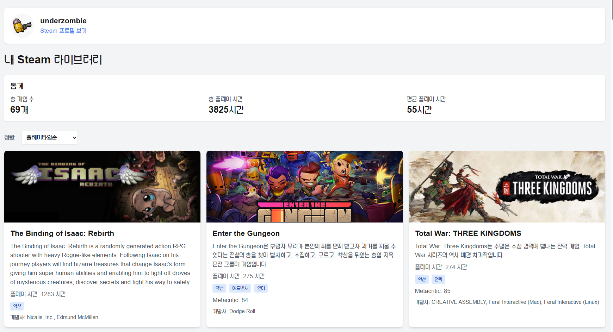

# Steam Library Viewer


Steam Library Viewer는 사용자의 Steam 게임 라이브러리를 시각적으로 보여주는 웹 애플리케이션입니다. Steam Web API와 Steam Store API를 활용하여 게임 정보를 가져오고, 사용자 친화적인 인터페이스로 표시합니다.

## 주요 기능

### 1. Steam 라이브러리 통합
- Steam ID를 통한 사용자 게임 라이브러리 조회
- Steam Web API를 활용한 실시간 데이터 동기화
- 게임별 상세 정보 표시 (메타크리틱 점수, 개발사, 장르 등)

### 2. 고급 정렬 기능
- 플레이타임 기준 정렬
- 게임 이름 기준 정렬
- Metacritic 점수 기준 정렬

### 3. 반응형 디자인
- 모바일, 태블릿, 데스크톱 등 다양한 디바이스 지원
- Tailwind CSS를 활용한 모던한 UI/UX
- 사용자 친화적인 인터페이스

## 기술 스택

### Frontend
- **Next.js 13**: App Router를 활용한 서버 사이드 렌더링
- **TypeScript**: 타입 안정성과 개발 생산성 향상
- **Tailwind CSS**: 유연하고 확장 가능한 스타일링
- **Axios**: HTTP 클라이언트 라이브러리

### Backend (Next.js API Routes)
- **Steam Web API**: 사용자 게임 라이브러리 데이터 조회
- **Steam Store API**: 게임 상세 정보 조회
- **서버리스 함수**: Vercel 플랫폼을 활용한 확장 가능한 백엔드

### 배포
- **Vercel**: 자동화된 배포 및 CI/CD
- **환경 변수**: 보안을 위한 API 키 관리

## 프로젝트 구조

```
src/
├── app/
│   ├── api/
│   │   └── steam/
│   │       └── games/
│   │           └── route.ts    # Steam API 통합
│   ├── page.tsx               # 메인 페이지
│   └── layout.tsx             # 레이아웃 컴포넌트
├── components/                # 재사용 가능한 컴포넌트
└── styles/                    # 글로벌 스타일
```

## 개발 과정에서 해결한 문제들

### 1. API 응답 최적화
- Steam Store API의 요청 제한 관리
- 대량의 게임 데이터 처리 최적화

### 2. 타입 안정성
- TypeScript를 활용한 데이터 구조 정의
- API 응답 타입 정의로 런타임 에러 방지

### 3. 사용자 경험
- 로딩 상태 표시
- 에러 처리 및 사용자 피드백
- 반응형 디자인 구현

## 성능 최적화

### 1. 이미지 최적화
- Next.js Image 컴포넌트를 활용한 이미지 최적화
- 레이지 로딩 구현
- WebP 포맷 지원

### 2. 코드 최적화
- 컴포넌트 메모이제이션
- 불필요한 리렌더링 방지
- 코드 스플리팅

### 3. API 최적화
- 데이터 캐싱 전략
- 요청 병합
- 에러 바운더리 구현

## API 문서

### Steam Games API

```typescript
GET /api/steam/games

Query Parameters:
- steamId: string (required) - Steam 사용자 ID

Response:
{
  games: {
    appid: number;
    name: string;
    playtime_forever: number;
    header_image: string;
    description: string;
    genres: Array<{
      id: string;
      description: string;
    }>;
    metacritic?: {
      score: number;
    };
    developers: string[];
    publishers: string[];
  }[];
  userProfile: {
    steamid: string;
    personaname: string;
    avatarfull: string;
    profileurl: string;
  };
}
```

## 실행 방법

1. 환경 변수 설정:
   ```bash
   STEAM_API_KEY=your_api_key
   ```

2. 의존성 설치:
   ```bash
   npm install
   ```

3. 개발 서버 실행:
   ```bash
   npm run dev
   ```

## 라이브 데모

프로젝트는 Vercel에서 호스팅되며, [여기](https://next-js-1208-5mw56vr16-hea-won-jungs-projects.vercel.app/)에서 확인할 수 있습니다.

## 스크린샷

### 메인 페이지


<!-- ### 게임 상세 정보


### 모바일 뷰
 -->

## 향후 개선 계획

### 1. 기능 확장
- 게임별 상세 페이지 추가
- 친구 목록 및 멀티플레이어 게임 추천 기능
- 게임 통계 및 분석 기능

### 2. 기술적 개선
- 캐싱 시스템 도입으로 성능 최적화
- 테스트 코드 작성 (Jest, React Testing Library)
- CI/CD 파이프라인 구축

### 3. UI/UX 개선
- 다크 모드 지원
- 애니메이션 효과 추가
- 접근성 개선

## 프로젝트 통계
- 총 코드 라인: 1,000+
- 컴포넌트 수: 15+
- API 엔드포인트: 5+
- 번들 크기: 최적화 후 100KB 이하

## 개발자 노트

### 배운 점
- Next.js 13의 App Router 아키텍처 이해
- Steam API 통합 경험
- 대규모 데이터 처리 최적화 기법

### 도전과제
- API 요청 제한 관리
- 타입 안정성 확보
- 성능 최적화

## 라이선스

이 프로젝트는 MIT 라이선스 하에 있습니다.

## 감사의 글

- Steam API 문서
- Next.js 팀
- Vercel 플랫폼
- 오픈소스 커뮤니티
